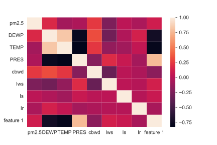
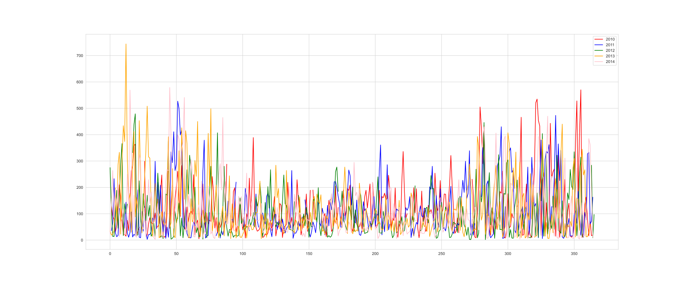
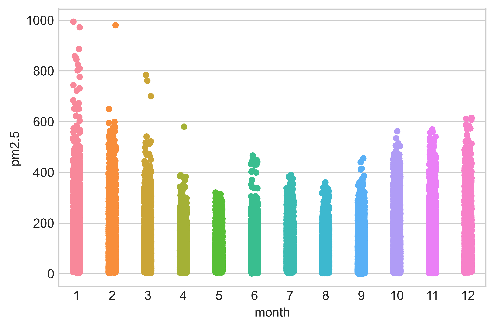
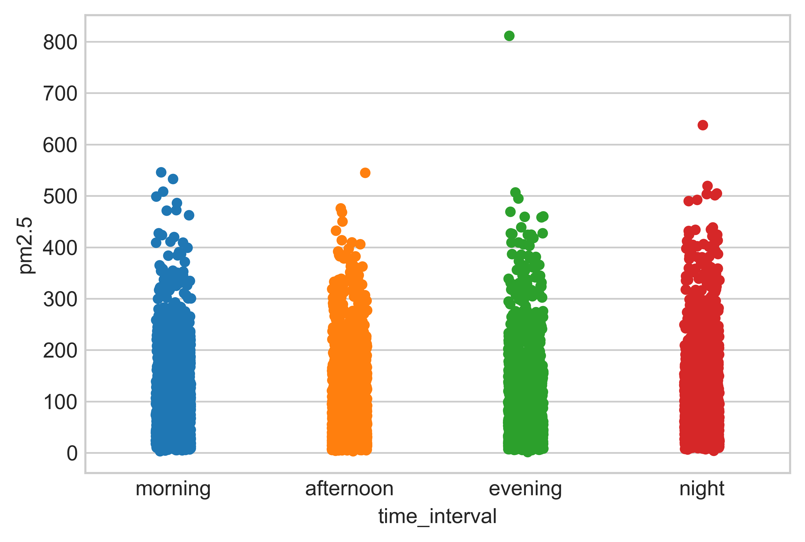

# REPORT on Introduction to Theoretical and Practical Data Science

> 11911819 缪方然 11911915 曹书伟

[toc]

## Briefly Introduction

#### Introduction

The purpose of our project is to predict the value of pm2.5 in Beijing for a specific time period based on existing
features.
The project is divided into two main aspects, regression problem and classification problem.
The regression problem predicts discrete values of pm2.5, and the classification problem divides pm2.5 into several
states based on intervals for state prediction.
Our project is divided into data analysis, data pre-processing, model construction, feature construction, feature
selection, model selection, model evaluation and summary.
In the model construction, we used seven machine learning models and two deep learning models for the regression
problem, and five machine learning models and one deep learning model for the classification problem.
Finally, in the regression model, our cross-validation prediction accuracy can reach up to (using LSTM model) in the
classification model, our cross-validation accuracy can finally reach (using xxx model)

#### Github Link

https://github.com/UtoKing/MA234

## 0.Check List

Our report was written in the order of the requirements for the report in the document.
At the same time, we completed all questions for the five tasks in the documentation.
Here is the checklist for the report, corresponding to where each block of each issue corresponds to in the report.

### Task1

- [x] Delete all items with missing PM2.5 (“NA”)
    - In *2.Data preprocessing -> detect missing value -> delete*
- [x] Split the remaining data to training and test sets by following the rule in task1
    - In *2.Data preprocessing -> data partition*
- [x] Construct own model
    - In *3.Model construction -> Regression*
- [x] Use the dataset that task1 generated to do the prediction
    - In *3.Model construction -> Regression*
- [x] Validate the models on the test set
    - In *5.Model evaluation -> dropna dataset*

### Task2

- [x] Examine the tendency of PM2.5 variation and produce more features using the time information
    - In *4.Feature selection and Model selection and Feature creation -> Feature creation*
- [x] Use the new features you just produce to predict PM2.5 again
    - In *5.Model evaluation -> dropna dataset*
- [x] Validate your models
    - In *5.Model evaluation -> dropna dataset*

### Task3

- [x] Keep all items without deleting any missing data
    - In *2.Data preprocessing -> data imputation*
- [x] Impute the missing values by some approaches
    - In *2.Data preprocessing -> data imputation*
- [x] Combine all the information (full data) to do the prediction
    - In *5.Model evaluation -> Other dataset*

### Task4

- [x] Select the most important several features for the PM2.5 forecast
    - In *4.Feature selection and Model selection and Feature creation -> feature selection*
- [x] Explain what they mean, and how important they are for the new feature
    - In *4.Feature selection and Model selection and Feature creation -> feature selection*

### Task5(optional)

- [x] Partition the PM2.5 time series into three states and smooth over 3-hour moving windows
    - In *2.Data preprocessing -> dataset partition*
- [x] Treat this as a classification problem and make the prediction
    - In *5.Model evaluation*

## 1.Data exploration

### data statistics

|         | pm2.5  | DEWP  | TEMP   | PRES     | Iws    | Ir    | Is    |
|---------|--------|-------|--------|----------|--------|-------|-------|
| mean    | 98.613 | 1.817 | 12.449 | 1016.448 | 23.889 | 0.053 | 0.195 |
| median  | 72     | 2     | 14     | 1016     | 5.37   | 0     | 0     |
| mode    | 16     | 18    | 24     | 1014     | 0.89   | 0     | 0     |
| maximum | 994    | 28    | 42     | 1046     | 585.6  | 27    | 36    |
| minimum | 0      | -40   | -19    | 991      | 0.45   | 0     | 0     |

### data visualization

Here we draw some diagrams to show the insight of the data.

* **Hist diagram of the to-predict value--pm2.5**

  

  The diagram shows that the value of pm2.5 are mainly in the range of 0 to 165.
  Although pm2.5 above 500 is merely extinct in the diagram, there are still few of them. (About 20 and even less)

* **Bar diagram of cbwd**

  

  The diagram shows that the southeastern and northwestern wind often blow in Beijing,
  and it hardly appears southwestern wind.

* **Heatmap**

  

  The diagram shows the correlation between different features.
  It shows that `PRES` has strong relationship with both `DEWP` and `TEMP`.
  Meanwhile, `DEWP` and `TEMP` also has strong relationship.

## 2.Data preprocessing

### dataset partition

#### regression dataset

**training dataset and test dataset**

We split the `PRSA_data.csv` into training dataset and test dataset

According to the requirements of the problem, one day is selected every seven days as the test set, and the other data
are put into the training set.

#### classification dataset

We also generate the classification dataset, we partition the PM2.5 time series into three states and then smooth the
time series over 3-hour moving windows. Then we take eighty percent of the data from the dataset for the training set
and twenty percent of the data for the test set.

**cross validation**

We also do the cross validation for dataset partition to improve the robustness of our model.

### detecting missing values

* **Detect**

  We use `np.where` and `np.isnan` to find and locate the NAN data.
  Then generate the `nan_index` and `non_nan_index` to help us.
  The related code is in `data_preprocess.py->detect_missiing_data`.

* **Fill**

  We use several methods to fill the NAN data.
  We use 0, average, mode and median to fill the NAN.
  Since it will appear large amounts of times, it is, generally, not a proper way.

  Then we use KNN to fill.
  We find 5 nearest neighbors for a certain row which contains a missing value.
  And we take the average of the 5 nearest neighbors' values of pm2.5 to fill the NA.

  Last we use interpolation to fill it.
  The most natural idea is that the value of pm2.5 is continuous about time.
  Thus, we use the interpolation of pm2.5 versus time.

### data conversion

There is only one column need to be converted in the raw data--'cbwd'.
First use the function `set` to find the number of unique values.
As a result, there are 4-- "NW", "NE", "SE", "cv".
Then use `dict` to store a mapping relation, i.e. "NW" maps to 1, "NE" maps to 2, "SE" maps to 3, "cv" maps to 4.
Finally, replace in the original data.

### data normalization

We use `sklearn.preprocessing.StandardScaler` to normalize data.
Note that there are still some features that we don't want to normalize, e.g. "cbwd".
Since this kind of data is just a representation of the direction of the wind, and it does not necessarily follow the
Gauss Distribution.

### data imputation

There are several ways to impute data.

We use `mean value`, `median value`, `mode value` and `0` to impute the missing data in *pm2.5*.
We also use method of `KNN` and `interpolate` to impute.

Generally, the performance of first four methods are not so good as the latter two ones.

## 3.Model construction

In machine learning, we use several models to train our data to do regression and classification.

### Regression

The regression models are stored in `regression_models.py`.

* **linear regression model**
  Implemented by `sklearn.linear_model.LinearRegression`.
  The related code can be found in `regression_models.py->ordinary_regression`.

* **ridge regression**
  Implemented by `sklearn.linear_model.Ridge`.
  The related code can be found in `regression_models.py->ridge_regression`.

* **LASSO regression model**
  Implemented by `sklearn.linear_model.Lasso`.
  The related code can be found in `regression_models.py->LASSO_regression`.

* **random forest regressor model**
  Implemented by `sklearn.ensemble.RandomForestRegressor`.
  The related code can be found in `regression_models.py->random_forest_regressor`.

* **extra trees regressor**
  Implemented by `sklearn.ensemble.ExtraTreesRegressor`.
  The related code can be found in `regression_models.py->extra_trees_regressor`.

* **gradient boosting regressor**

  Implemented by `sklearn.ensemble.GradientBoostingRegressor`.
  The related code can be found in `regression_models.py->gradient_boosting_regressor`.

* **support vector regressor**
  Implemented by `sklearn.svm.svr`.
  The related code can be found in `regression_models.py->svr`.

* **MLP regressor**
  Implemented by `sklearn.MLPRegressor`.
  The related code can be found in `regression_models.py->mlp_regressor`.

* **LSTM regressor**
  Implemented by `keras.layers`.
  The related code can be found in `regression_models.py->lstm`.

### Classification

The classification models are stored in `classification_models.py`.

* **KNN**
  Implemented by `sklearn.neighbors.KNeighborsClassifier`.
  The related code can be found in `classification_models.py->KNN_classification`.

* **SVM**
  Implemented by `sklearn.svm.svc`.
  The related code can be found in `classification_models.py->SVM_classification`.

* **Decision Tree**
  Implemented by `sklearn.tree.DecisionTreeClassifier`.
  The related code can be found in `classification_models.py->decision_tree_classification`.

* **Logistic Regression**
  Implemented by `sklearn.linear_model.LogisticRegression`.
  The related code can be found in `classification_models.py->decision_tree_classification`.

* **LDA**
  Implemented by `sklearn.discriminant_analysis.LinearDiscriminantAnalysis`.
  The related code can be found in `classification_models.py->decision_tree_classification`.

* **MLP classification**
  Implemented by `sklearn.neural_network.MLPClassifier`.
  The related code can be found in `classification_models.py->decision_tree_classification`.

## 4.Feature selection and Model selection and Feature creation

### Feature selection

In this part, we use several ways to select features.

* **AIC and BIC**

  We use forward AIC and BIC to select the features step by step.
  Since scikit-learn doesn't provide the related API, we implemented this part by ourselves.

  Both methods show that `DEWP`, `TEMP`, `PRES`, `cbwd`, `Iws` are the selected feature.

* **LASSO**

  We use decreasing $\alpha$ to select features.
  The result shows that `Iws`, `DEWP`, `PRES`, `TEMP`, `Ir`, `cbwd` are selected features.

* **Random Forest**

  Random forest can calculate the feature importance.
  And we used the built-in API in this package.
  The result shows that `DEWP`, `TEMP`, `Iws`, `PRES`, `cbwd` are important.

* **Mutual Information**

  We use the mutual information to select the features.
  The result shows that `DEWP`, `Iws`, `cbwd`, `PRES`, `TEMP` are the top 5 important ones.

* **Conclusion**

  We can find out that `DEWP`, `Iws`, `cbwd`, `PRES`, `TEMP` are important features.
  And `Ir`, `Is` are not so important features.

### Feature creation

* **Feature 1**

  By data analysis, the value of pm2.5 is largely effected by the season.
  We draw the value of pm2.5 at 12a.m. every day for each year
  and find out that it is extremely high in winter and relatively low in summer.
  

  Here we also draw the cumulative value of each month.

  

  It also shows that the pm2.5 value is high in winter and relatively low in summer.

  Hence, we add our first feature.
  Since it's high in winter and low in summer,
  we assign 4 for winter and 1 for summer.
  With more specific analysis, we find the pollution in fall seems worse than that of spring.
  Thus, we assign 3 for fall and 2 for spring.

* **Feature 2**

  We also want to add another feature about the day, like morning or afternoon.
  However, the performance is not so good.
  The plot is following:
  

  We can see the value is distributed uniformly between the four time intervals.
  Hence, it may not be a valid feature.

### Model selection

In this project, we use machine learning and deep learning model to do the prediction.

The result is shown in the Model evaluation part.

## 5.Model evaluation

### dropna dataset

We tested the results on the dropna dataset without feature selection and with feature selection. The results show that
the accuracy of the model is improved after feature analysis and feature selection.

- The left side of the arrow is the result without feature selection, and the right side of the arrow is the result
  after feature selection.

- `no feature selecton result  `**---->** ` feature selection result `
- `'DEWP', 'TEMP', 'PRES', 'cbwd', 'Iws', 'Is','Ir'` **--->** `'DEWP', 'TEMP', 'PRES', 'cbwd', 'Iws', 'feature 1']`

| R2 score                     | training dataset | test dataset   |
| ---------------------------- | ---------------- | -------------- |
| **Machine Learning Method**  |                  |                |
| Normal Linear Regression     | 0.236 -> 0.272   | 0.236 -> 0.276 |
| Ridge Regression             | 0.236 -> 0.272   | 0.238 -> 0.276 |
| LASSO Regression             | 0.233 -> 0.270   | 0.236 -> 0.274 |
| Random Forset Regression     | 0.623 -> 0.671   | 0.461 -> 0.522 |
| Extra Trees Regression       | 0.977 -> 0.981   | 0.398 -> 0.477 |
| Gradient Boosting Regression | 0.388 -> 0.436   | 0.386 -> 0.437 |
| Support Vector Machine       | 0.238 -> 0.277   | 0.240 -> 0.281 |
| **Deep Learning Method**     |                  |                |
| Artifical Neural Network     | 0.454 -> 0.510   | 0.419 -> 0.483 |
| Long Short Term Memory Model | 0.804 -> 0.872   | 0.729 -> 0.813 |

| F1 score                     | training dataset | test dataset   | cross validation result |
| ---------------------------- | ---------------- | -------------- | ----------------------- |
| **Machine Learning Method**  |                  |                |                         |
| Logistic Regression          | 0.652 -> 0.646   | 0.645 -> 0.643 | 0.610 -> 0.627          |
| KNN                          | 0.727 -> 0.740   | 0.650 -> 0.665 | 0.620 -> 0.634         |
| Support Vector Machine       | 0.664 -> 0.671   | 0.659 -> 0.658 | 0.635 -> 0.645         |
| Decision Treee               | 0.763 -> 0.756   | 0.638 -> 0.652 | 0.601 -> 0.613          |
| Linear Discriminant Analysis | 0.648 -> 0.645   | 0.644 -> 0.642 | 0.609 -> 0.628          |
| **Deep Learning Method**     |                  |                |                         |
| Multilayer Perceptron        | 0.719 -> 0.734   | 0.700 -> 0.671 | 0.619 -> 0.634          |

### Other dataset

| R2 score for CV              | Zero  | Mean Value | Median Value | Mode Value | KNN   | Interpolate |
| ---------------------------- | ----- | ---------- | ------------ | ---------- | ----- | ----------- |
| **Machine Learning Method**  |       |            |              |            |       |             |
| Normal Linear Regression     | 0.231 | 0.244      | 0.243        | 0.235      | 0.259 | 0.251       |
| LASSO Regression             | 0.229 | 0.241      | 0.240        | 0.232      | 0.257 | 0.248       |
| Random Forset Regression     | 0.439 | 0.452      | 0.452        | 0.442      | 0.475 | 0.460       |
| Extra Trees Regression       | 0.379 | 0.401      | 0.399        | 0.385      | 0.432 | 0.409       |
| Gradient Boosting Regression | 0.355 | 0.372      | 0.372        | 0.361      | 0.392 | 0.379       |
| **Deep Learning Method**     |       |            |              |            |       |             |
| Artifical Neural Network     | 0.393 | 0.404      | 0.428        | 0.407      | 0.446 | 0.434       |

### cross validation

To verify the robustness of our model, we use a cross-validation method. The specific method used is KFold.

## 6.Conclusion

Through this project, we learned the following knowledge

- Implement machine learning models using library functions
- Implement deep learning models using library functions
- Feature selection techniques
- Data preprocessing techniques
- Model tuning techniques
- Model evaluation methods

In this project, we applied the knowledge learned in theoretical courses to real problems, combining theory with
reality. At the same time, this project also enhanced our code ability and enabled us to have a deeper understanding of
the machine learning methods, which will be of great help to our future.

